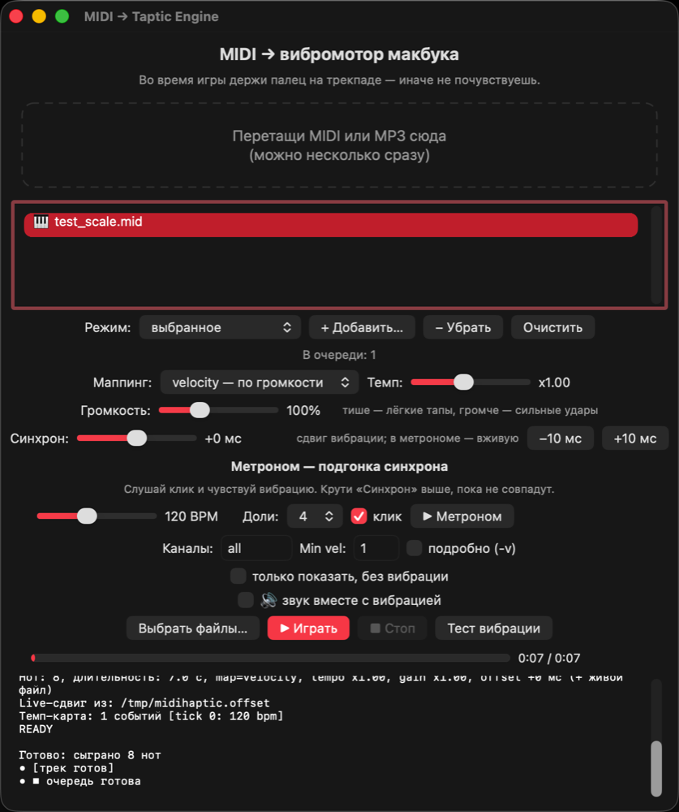
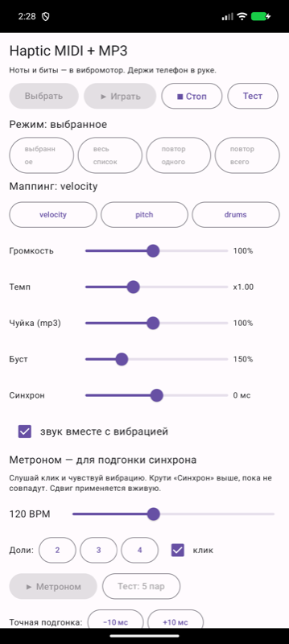
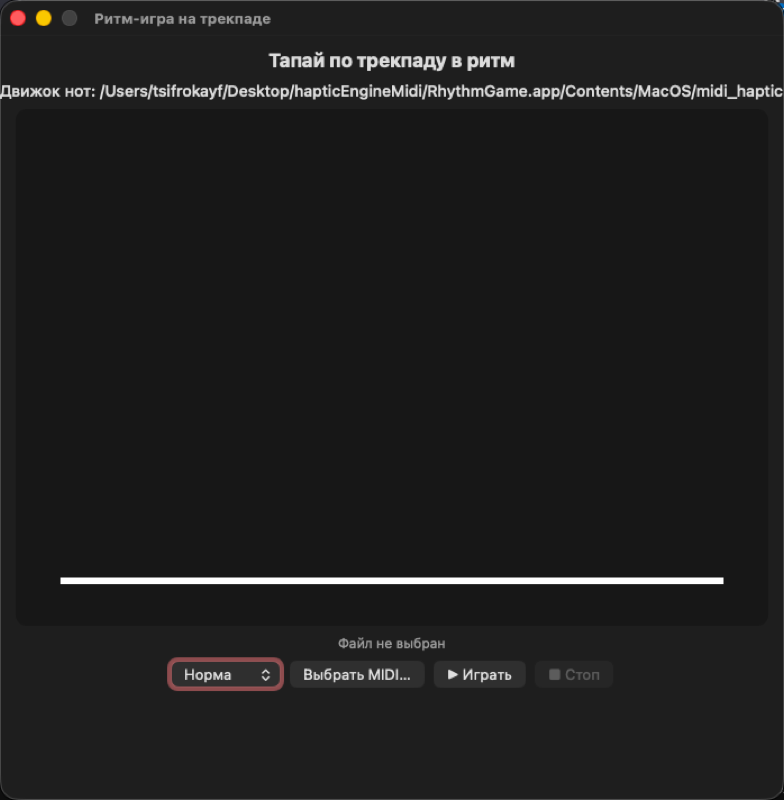

# mac-taptic-midi — MIDI & MP3 on a MacBook vibration motor (Taptic Engine, ARM)

English | [Русский](README_RU.md)

---

Plays MIDI and MP3 files through the **Taptic Engine of the Force Touch trackpad**
on Apple Silicon MacBooks (M1/M2/M3/M4/M5/M6). Every MIDI note becomes a click/tap
of the vibration motor, MP3 thumps along with the beats.
Tested on MacBook Air ARM64, macOS 26. Includes an **Android analog**.





## How it works

A MacBook has no phone-style vibration motor — it has a **Taptic Engine under
the Force Touch trackpad**. The public API (`NSHapticFeedbackManager`) only
knows 3 boring patterns and needs a finger on the trackpad. So the program
goes the `mactic` way: it loads the private `MultitouchSupport.framework`
**via `dlopen`/`dlsym`** (mandatory on ARM — direct linking breaks on Pointer
Authentication) and drives the actuator directly:
`MTActuatorCreateFromDeviceID / Open / Actuate / Close`.

MIDI is parsed by dependency-free code: format 0/1, multiple tracks,
`note_on` (velocity 0 = note off), tempo map (`FF 51`), running status, VLQ.

Note → vibration mapping (6 firmware waveforms: 1 weak click, 2 strong click,
3 buzz, 4 light tap, 5 medium tap, 6 strong tap):

- `--map velocity` (default): loudness → hit strength (quiet = light tap, loud = strong hit)
- `--map pitch`: pitch → hit character (bass = heavy click, highs = light taps)
- `--map drums`: channel 10 handled separately (kick → strong click, snare → strong tap, hats → light tap)

MP3 (`audio_haptic`) takes a different path: the file goes through `afconvert`
into a temporary 22050 Hz mono wav, then onset detection (energy flux +
adaptive 1-second median threshold) finds the beats, beat strength → waveform.
Detector sensitivity: `-s 0.5..2.0` (higher = catches quiet beats).

## Supported hardware

Any Mac with a trackpad that has a Taptic Engine:
- Any MacBook from 2015 on Apple Silicon (M1–M6) or Intel
- Any desktop Mac (mini, Studio, iMac, Mac Pro) with a Magic Trackpad 2

Two separate builds: `MidiHaptic-arm64.dmg` for Apple Silicon,
`MidiHaptic-intel.dmg` for Intel Macs (the private-framework calls are
verified per architecture — the Intel build is tested under Rosetta).
The engine auto-detects the device struct layout: if your hardware differs,
it scans for a working offset by itself (`--device-offset` overrides it).

## The app (double-click)

```bash
make app
open MidiHapticApp.app
```

A full `.app` bundle with an icon: opens with a double-click,
`.mid` and `.mp3` open via “Open With” or by dragging onto the icon.

In the window:
- **Playlist**: drop several files at once — MIDI (🎹) and audio (🔊): mp3/wav/m4a/aiff/flac
- **Modes**: selected / whole list / 🔂 repeat one / 🔁 repeat all
- **🔊 Sound**: MIDI plays through a synth, MP3 plays the original, in sync with vibration.
  Starts strictly together with the first vibration: the engine emits a READY
  marker and the sound starts on it (no one-second pause when played from the window)
- **Volume** 10–300%, **sync** ±1000 ms (vibration shift vs sound, ±10 ms buttons
  for fine tuning). The shift is live: engines re-read it before every
  note/hit — tweak it mid-track
- **Metronome**: BPM/beats/synthesized “tok” click + visual beat dots (◉ = accent).
  The shift applies live: hear the click, feel the buzz, turn “Sync” until they
  merge. The same shift is passed as `--offset-ms` to the engines for files
- **Progress bar** with track time, mapping, channels, live engine log below
- **✨ Demo**: walks through everything in sequence — all 6 waveforms,
  volume (quiet/normal/loud) and mapping (velocity/pitch/drums) — with a
  pulsing indicator and step title. Cancellable with ■ Stop

Without the bundle it works too: `make MidiHapticApp && ./MidiHapticApp`
(it looks for `midi_haptic` next to itself — keep them in one folder).

## Terminal usage

Xcode Command Line Tools only (`xcode-select --install`).

```bash
cd mac-taptic-midi
make            # Apple Silicon
make intel      # Intel Macs (x86_64, needs Xcode CLT)
```

## Usage

```bash
# 1. Check: is there a Taptic Engine
./midi_haptic --scan

# 2. Feel check (finger on the trackpad!)
./midi_haptic --list

# 3. See what the MIDI becomes, no vibration
./midi_haptic song.mid --dry-run -v

# 4. Play! Finger on the trackpad!
./midi_haptic song.mid

# 5. Drums only, faster, channels 1 and 10
./midi_haptic song.mid -m drums -t 1.5 -c 1,10 -v

# 6. MP3 on beats (finger on the trackpad!)
./audio_haptic song.mp3
./audio_haptic song.mp3 -s 1.5 -g 1.3 --dry-run
```

All options: `./midi_haptic --help`

| Option | What it does |
|---|---|
| `-m velocity\|pitch\|drums` | mapping mode |
| `-t 0.25..4.0` | tempo multiplier (2.0 = twice as fast) |
| `-g 0.10..2.00` | volume: velocity multiplier (quieter → light taps, louder → strong hits) |
| `--loop N` | repeat playback N times (1..99) |
| `--info` | only parse and show duration, don't play |
| `--offset-ms MS` | vibration shift vs sound, ms (−1000..1000) |
| `--offset-file PATH` | live shift: re-read ms from a file before every note (the GUI writes the slider there) |
| `--immediate` | no “starting in 1 sec” pause, READY marker for GUI-synced start |
| `-w, --wave N` | single waveform hit 1..20 with no MIDI file (for demos) |
| `--device-offset N` | device ID struct offset (default 64, auto-probed if wrong) |
| `-c all\|1,10` | which MIDI channels to play (1–16) |
| `--min-vel N` | drop quiet notes |
| `--max-notes N` | note limit (handy for testing) |
| `-n, --dry-run` | only print, no vibration |
| `-v` | print every note |
| `-d ID` | multitouch device ID manually (usually auto-detected) |

`audio_haptic`: `-g` (volume), `-s 0.5..2.0` (sensitivity), `--min-gap MS`,
`--max-hits N`, `--offset-ms MS`, `--offset-file PATH`, `-n`, `--info`, `-v`.
Full list: `./audio_haptic --help`

## Important

1. **A finger must rest on the trackpad** — otherwise the Taptic Engine is barely
   felt. That's how Force Touch works.
2. The actuator only does short “toks”, not long notes or volume — a melody
   becomes rhythm clicks. Drums and bass work best.
   Honest caveat: the hardware has fixed patterns, the private API has no
   “amplitude” knob — so volume is software: it scales velocity before picking
   a pattern (quiet = light taps, loud = strong hits).
3. Private API is used — any macOS update may break it (fix by cycling
   waveforms via `--list`).
4. Needs a trackpad with a Taptic Engine (see supported hardware above) —
   and a finger resting on it during playback.

## More toys

**typeclick** — typewriter clicks: every keypress fires the Taptic Engine.
Single waveforms blur together on some hardware, so contrast comes from
patterns: letters = single light tap, space/tab = single medium,
enter = DOUBLE strong click, backspace = weak, esc = buzz, modifiers silent.
Tune each group: `--space/--tab/--enter/--delete/--esc/--key W or WxR`
(feel them first with `--list`, check with `--probe-key 49`),
or write `~/.typeclickrc` (`enter=2x2` per line, reloaded live).
Needs Input Monitoring permission: System Settings →
Privacy → Input Monitoring → add `typeclick`.
```bash
make typeclick
./typeclick -v   # Ctrl-C to quit, finger on the trackpad
```

**TypeBar.app** — the same typewriter as a menu-bar icon ⌨️: on/off toggle,
per-group waveform + repeat count (bursts are unmistakable on any hardware),
gap presets, pattern test, **▶ mode demo** (all groups in sequence with a
status line — easy to compare). Shares `~/.typeclickrc` with the CLI version.
```bash
make typebar-app
open TypeBar.app
```

**RhythmGame.app** — rhythm game on the trackpad: drop a MIDI onto the window
(typically 8-th note melodies work best), notes fall, tap the trackpad on the beat.
Perfect/Good/Miss judging, combo, S/A/B/C ranks,
3 difficulties. Tap detection via MultitouchSupport, hits confirmed by haptics.
```bash
make rhythm-app
open RhythmGame.app song.mid
```

## Android analog

Folder `android/` — the same idea on a phone (Kotlin/Compose): MIDI parser,
beat detector via MediaCodec, vibration with **real amplitude** (1–255),
metronome with sync calibration, playlist, sound. Ready APK:
`android/HapticMidi-debug.apk`, tested on an emulator.
Details in `android/README.md` (in Russian).

## Files

- `midi_haptic.c` — MIDI engine (parser + Taptic Engine driver)
- `audio_haptic.c` — audio engine (afconvert + beat detector + Taptic Engine)
- `MidiHapticGui.swift` — native window (playlist, sound, repeat, progress, metronome)
- `HapticDriver.swift` — Taptic Engine access from Swift (for the metronome)
- `main.swift` — GUI entry point
- `typeclick.c` — typewriter clicks via a global key tap
- `RhythmGame.swift` (+ `game-main.swift`, `RhythmGame-Info.plist`) — trackpad rhythm game (`make rhythm-app`)
- `TypeBar.swift` (+ `typebar-main.swift`, `TypeBar-Info.plist`) — typewriter settings in the menu bar (`make typebar-app`)
- `Info.plist`, `gen_icon.py` — `.app` bundle build (`make app`)
- `Makefile` — `make` (engines), `make MidiHapticApp` (window), `make app` (bundle)
- `gen_test_midi.py` — dependency-free test MIDI generator
- `test_scale.mid` — scale with rising loudness
- `test_chords_drums.mid` — chords + tempo change + drums
- `gen_test_audio.py` — beat synthesizer; `test_beat.wav` / `test_beat.mp3`
- `screenshots/` — app screenshots

## Approach credits

- `mactic` (MatMercer) — loading MultitouchSupport via dlopen on ARM, waveform IDs, device ID offset 64
- Apple docs: `NSHapticFeedbackManager` (public but weak API — hence not used)
